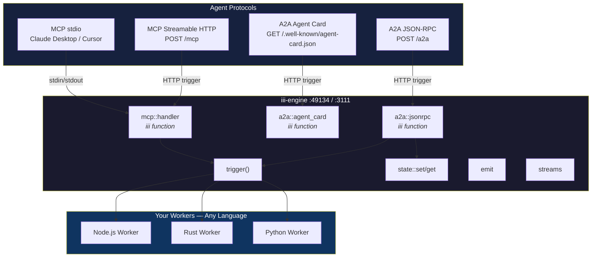
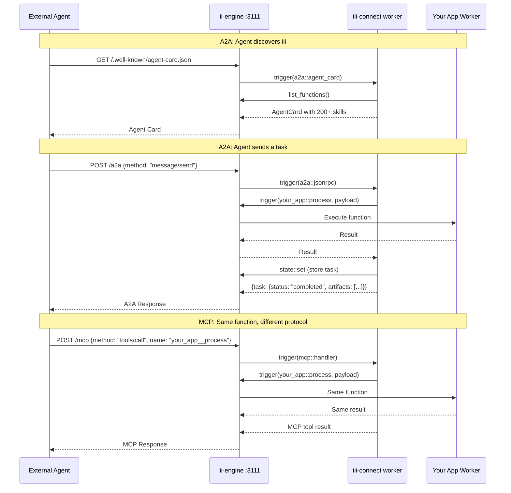

# iii-connect

An [iii-engine](https://github.com/iii-hq/iii) worker that makes every registered function available to AI agents through MCP and A2A protocols.

Not a bridge. Not an adapter. A worker — it registers protocol handlers as iii functions, so every request flows through the engine with full observability, tracing, and state management.

## Why This Matters

iii-engine is built on three primitives: **Worker** (who runs code), **Function** (what code runs), **Trigger** (what causes code to run). Any worker can register functions in any language — Rust, Node.js, Python.

`iii-connect` registers protocol handlers as functions:



A Python data scientist registers a function. A Rust systems engineer registers another. An agent calls both through MCP or A2A — same engine, same observability, no extra code.

## How It Works

`iii-connect` is a Rust worker that calls `register_worker()` and registers three iii functions:

| iii Function | HTTP Trigger | What It Does |
|---|---|---|
| `mcp::handler` | `POST /mcp` | Handles all MCP methods (tools, resources, prompts) |
| `a2a::agent_card` | `GET /.well-known/agent-card.json` | Serves the A2A Agent Card with all skills |
| `a2a::jsonrpc` | `POST /a2a` | Handles A2A methods (message/send, tasks/get, cancel, list) |

Every request flows through the engine — you see it in traces, it hits the metrics, it uses the same state/events/streams as everything else.



## Quick Start

### Install

```bash
curl -fsSL https://raw.githubusercontent.com/iii-hq/iii-connect/main/install.sh | sh
```

Or with Cargo:

```bash
cargo install --git https://github.com/iii-hq/iii-connect
```

### Run

```bash
iii-connect                        # MCP stdio (Claude Desktop, Cursor)
iii-connect --a2a                  # MCP stdio + A2A on engine HTTP
iii-connect --a2a --no-stdio       # headless, HTTP only
```

### Claude Desktop

```json
{
  "mcpServers": {
    "iii": {
      "command": "iii-connect",
      "args": ["--engine-url", "ws://localhost:49134"]
    }
  }
}
```

### Cursor / VS Code

```json
{
  "mcpServers": {
    "iii": {
      "command": "iii-connect"
    }
  }
}
```

## Three Protocols, One Engine

### MCP (Model Context Protocol)

**Spec:** 2025-11-25 | **Transports:** stdio + Streamable HTTP (`POST /mcp`)

Every iii function becomes an MCP tool automatically. Function ID `state::set` becomes tool name `state__set`.

| MCP Feature | Status |
|---|---|
| tools/list, tools/call | All engine functions exposed |
| resources/list, resources/read | functions, workers, triggers, context |
| prompts/list, prompts/get | register-function, build-api, setup-cron, event-pipeline |
| notifications/tools/list_changed | Live updates when functions change |
| Streamable HTTP | POST /mcp on engine port |

### A2A (Agent-to-Agent Protocol)

**Spec:** v0.3 (v1.0 method names accepted) | **Transport:** HTTP on engine port

Every iii function becomes an A2A skill. Agents discover iii via the standard Agent Card.

| A2A Feature | Status |
|---|---|
| Agent Card | `GET /.well-known/agent-card.json` |
| message/send (SendMessage) | Sync function invocation → Task result |
| tasks/get (GetTask) | Poll task state from iii KV |
| tasks/cancel (CancelTask) | Cancel with terminal state check |
| tasks/list (ListTasks) | List all tasks from iii KV |
| Task state | Stored in `state::set/get` (scope: `a2a:tasks`) |
| ISO 8601 timestamps | Compliant |
| Response envelope | `{"task": {...}}` wrapper |

### Built-in MCP Tools

| Tool | Description |
|---|---|
| `iii_worker_register` | Spawn a Node.js or Python worker on the fly |
| `iii_worker_stop` | Stop a spawned worker |
| `iii_trigger_register` | Attach an http/cron/queue trigger to a function |
| `iii_trigger_unregister` | Remove a trigger |
| `iii_trigger_void` | Fire-and-forget invocation |
| `iii_trigger_enqueue` | Route through named queue |

## The iii Advantage

### Write once, expose everywhere

Register a function in any language. It's instantly available via MCP AND A2A. No protocol-specific code needed.

```js
import { registerWorker } from 'iii-sdk'
const iii = registerWorker('ws://localhost:49134')

iii.registerFunction({ id: 'orders::process' }, async (input) => {
  return { orderId: input.id, status: 'processed' }
})

iii.registerTrigger({
  type: 'http',
  functionId: 'orders::process',
  config: { api_path: '/orders', http_method: 'POST' }
})
```

Now an MCP client calls `orders__process` and an A2A agent calls it via `message/send` — same function, same result, same traces.

### Full observability

Every protocol request is an iii function invocation. You see it in:
- Engine logs (structured, with trace correlation)
- OpenTelemetry traces (distributed tracing across workers)
- Prometheus metrics (invocation count, duration, status)
- iii Console (real-time function calls, worker health)

### Dynamic at runtime

An AI agent can use `iii_worker_register` to spawn new workers, `iii_trigger_register` to add triggers — extending its own capabilities at runtime. New functions immediately appear in both MCP `tools/list` and the A2A Agent Card.

### Trigger Actions

Three routing modes for every function:

```
Sync (default)  →  Wait for result         →  tools/call, message/send
Void            →  Fire-and-forget         →  iii_trigger_void
Enqueue         →  Route through queue     →  iii_trigger_enqueue
```

## Project Structure

```
iii-connect/
├── Cargo.toml
├── README.md
└── src/
    ├── main.rs              # CLI, register_worker(), mode selection
    ├── lib.rs
    ├── json_rpc.rs          # Shared JSON-RPC 2.0 types (MCP + A2A)
    ├── mcp/
    │   ├── handler.rs       # mcp::handler function + MCP logic
    │   ├── prompts.rs       # 4 guided workflows
    │   └── mod.rs
    ├── a2a/
    │   ├── handler.rs       # a2a::agent_card + a2a::jsonrpc functions
    │   ├── types.rs         # AgentCard, Task, Message, Part, Artifact
    │   └── mod.rs
    ├── transport/
    │   └── stdio.rs         # stdin → handler.handle() → stdout
    └── worker_manager/
        └── mod.rs           # Spawn ephemeral Node.js/Python workers
```

12 files. 1,673 lines. 3.8MB binary. Zero external HTTP dependencies.

## Testing

```bash
npx @anthropic/mcp-inspector iii-connect --engine-url ws://localhost:49134
```

```bash
curl http://localhost:3111/.well-known/agent-card.json

curl -X POST http://localhost:3111/mcp \
  -H "Content-Type: application/json" \
  -d '{"jsonrpc":"2.0","id":1,"method":"tools/list"}'

curl -X POST http://localhost:3111/a2a \
  -H "Content-Type: application/json" \
  -d '{"jsonrpc":"2.0","id":1,"method":"message/send","params":{"message":{"messageId":"m1","role":"user","parts":[{"data":{"function_id":"state::set","payload":{"scope":"test","key":"x","data":{"ok":true}}}}]}}}'
```

## Related

- [iii-engine](https://github.com/iii-hq/iii) — Worker/Function/Trigger engine
- [iii-sdk (crates.io)](https://crates.io/crates/iii-sdk) — Rust SDK v0.9.0
- [iii-sdk (npm)](https://www.npmjs.com/package/iii-sdk) — Node.js SDK v0.9.0
- [iii-sdk (PyPI)](https://pypi.org/project/iii-sdk/) — Python SDK

## License

Apache License 2.0
