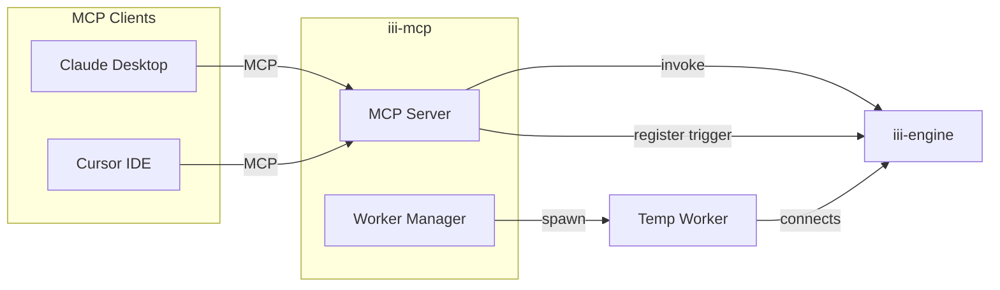
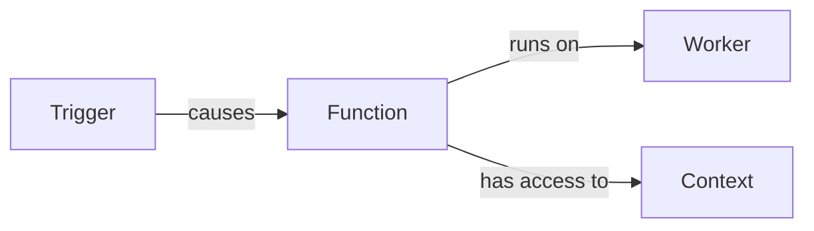
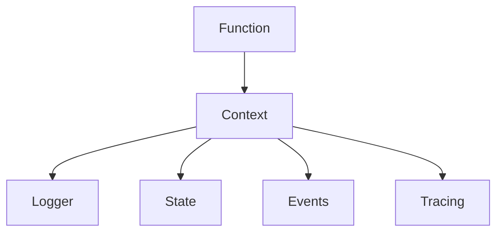
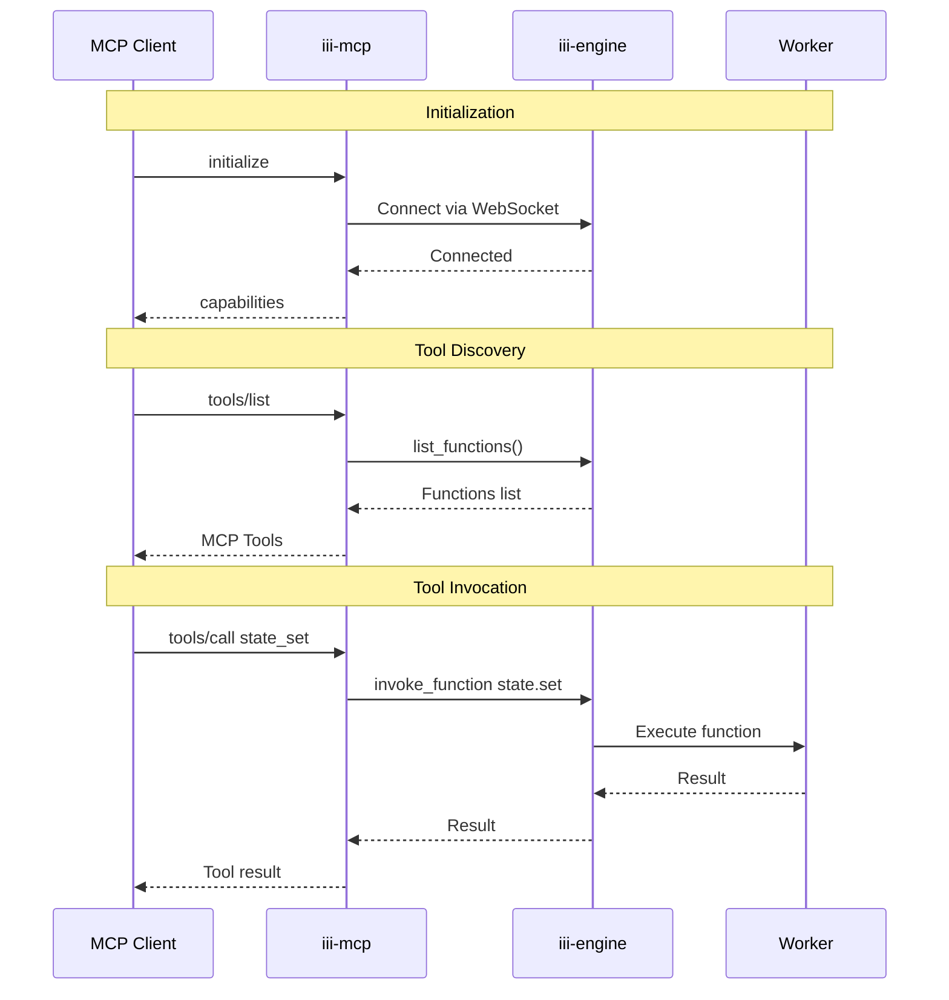

# iii-mcp

MCP (Model Context Protocol) server for [iii-engine](https://github.com/MotiaDev/iii-engine).

## Overview

`iii-mcp` is a standalone Rust binary that connects to an iii-engine instance and exposes its capabilities through the [Model Context Protocol (MCP)](https://modelcontextprotocol.io/). This allows AI assistants like Claude Desktop, Cursor, and VS Code Copilot to interact with iii-engine's three core primitives:

- **Worker** — Who runs code
- **Function** — What code runs  
- **Trigger** — What causes code to run

AI agents can create workers on-demand, invoke functions, and register triggers — all without user intervention.

## Architecture



## The Three Primitives

iii-engine is built on three core primitives:

| Primitive | What it is | MCP Tools |
|-----------|------------|-----------|
| **Worker** | Who runs code | `iii_worker_create`, `iii_worker_stop` |
| **Function** | What code runs | `tools/call` (invoke any function) |
| **Trigger** | What causes code to run | `iii_trigger_register`, `iii_trigger_unregister` |
| **Context** | What functions have access to | Logger, State, Events, Tracing tools |



### Worker — Who Runs Code

Workers are processes that connect to iii-engine and register functions they can execute.

```
iii_worker_create   → Create a temp worker with custom code
iii_worker_stop     → Stop and cleanup a worker
```

### Function — What Code Runs

Functions are the units of work. Each function has a path (e.g., `myservice.process_order`) and runs on a worker.

```
tools/call          → Invoke any registered function
tools/list          → List all available functions
```

### Trigger — What Causes Code to Run

Triggers wire up automation: "when X happens, call function Y".

```
iii_trigger_register    → Register a trigger (cron, event, http, etc.)
iii_trigger_unregister  → Remove a trigger
```

### Context — What Functions Have Access To

Context is the runtime environment available to functions during execution. It's nested under Function conceptually — it represents what a function can use when it runs.



| Context Capability | Available Tools |
|-------------------|-----------------|
| **Logger** | `engine_log_info`, `engine_log_debug`, `engine_log_warn`, `engine_log_error`, `engine_log_trace` |
| **State** | `state_get`, `state_set`, `state_delete`, `state_update`, `state_list` |
| **Events** | `emit`, `publish` |
| **Tracing** | `engine_baggage_get`, `engine_baggage_set`, `engine_baggage_getAll` |

## MCP Tools

### Built-in Tools (Core Primitives)

| Tool | Primitive | Description |
|------|-----------|-------------|
| `iii_worker_create` | Worker | Create a temporary worker with custom function code |
| `iii_worker_stop` | Worker | Stop a spawned worker and clean up |
| `iii_trigger_register` | Trigger | Register a trigger to invoke a function |
| `iii_trigger_unregister` | Trigger | Remove a registered trigger |

### iii-engine Functions

All iii-engine functions are automatically exposed as MCP tools:

**State Operations:**
- `state_set` - Set a value in state
- `state_get` - Get a value from state
- `state_delete` - Delete a value from state
- `state_update` - Update a value in state
- `state_list` - List all values in a group

**Event Operations:**
- `emit` - Emit an event to a topic

**Engine Introspection:**
- `engine_functions_list` - List all registered functions
- `engine_workers_list` - List all connected workers with metrics
- `engine_triggers_list` - List all active triggers

**Custom Functions:**
- Any functions registered by workers are automatically exposed as tools

### MCP Resources

Read-only access to iii-engine data:

| Resource URI | Description |
|--------------|-------------|
| `iii://functions` | List of all registered functions |
| `iii://workers` | Connected workers with metrics |
| `iii://triggers` | Active triggers |
| `iii://context` | Runtime context capabilities (logging, state, events, tracing) |

## Installation

### Quick Install (Linux/macOS)

```bash
curl -fsSL https://raw.githubusercontent.com/MotiaDev/iii-mcp/main/install.sh | bash
```

Or with a custom install directory:

```bash
INSTALL_DIR=/usr/local/bin curl -fsSL https://raw.githubusercontent.com/MotiaDev/iii-mcp/main/install.sh | bash
```

### Prerequisites

- A running iii-engine instance
- For building from source: Rust 1.85+ (with 2024 edition support)

### Build from Source

```bash
# Clone the repository
git clone https://github.com/MotiaDev/iii-mcp.git
cd iii-mcp

# Build release version
cargo build --release

# Binary will be at target/release/iii-mcp
```

### Using Cargo Install

```bash
cargo install --path .
```

## Usage

### Command Line

```bash
# Connect to local iii-engine (default: ws://localhost:49134)
iii-mcp

# Connect to a specific iii-engine instance
iii-mcp --engine-url ws://192.168.1.100:8080

# With debug logging (logs to stderr)
iii-mcp --engine-url ws://localhost:49134 --debug
```

### CLI Options

```
Usage: iii-mcp [OPTIONS]

Options:
  -e, --engine-url <ENGINE_URL>  iii-engine WebSocket URL [default: ws://localhost:49134]
  -d, --debug                    Enable debug logging
  -h, --help                     Print help
  -V, --version                  Print version
```

## Configuration

### Claude Desktop

Add to `~/Library/Application Support/Claude/claude_desktop_config.json` (macOS) or `%APPDATA%\Claude\claude_desktop_config.json` (Windows):

```json
{
  "mcpServers": {
    "iii": {
      "command": "/path/to/iii-mcp",
      "args": ["--engine-url", "ws://localhost:49134"]
    }
  }
}
```

### Cursor IDE

Add to your Cursor MCP configuration:

```json
{
  "mcpServers": {
    "iii": {
      "command": "/path/to/iii-mcp",
      "args": ["--engine-url", "ws://localhost:49134"]
    }
  }
}
```

## Examples

Once configured, you can interact with iii-engine through natural language:

### List Available Functions

**User:** "What functions are available in iii-engine?"

**AI:** *calls `tools/list`*
```
Available tools:
- state_set: Set a value in state
- state_get: Get a value from state
- emit: Emit an event
- engine_functions_list: List all functions
- myapp_process_order: Process an order (from worker)
...
```

### Manage State

**User:** "Set user 123's name to John in the users state group"

**AI:** *calls `state_set` tool*
```json
{
  "name": "state_set",
  "arguments": {
    "group_id": "users",
    "item_id": "123",
    "data": {"name": "John", "email": "john@example.com"}
  }
}
```
→ Success

### Emit Events

**User:** "Emit an order.created event for order 456"

**AI:** *calls `emit` tool*
```json
{
  "name": "emit",
  "arguments": {
    "topic": "order.created",
    "data": {"order_id": "456", "total": 99.99}
  }
}
```
→ Event emitted

### Inspect Workers

**User:** "Show me all connected workers"

**AI:** *calls `engine_workers_list` tool*
```
Connected workers:
1. worker-abc (Node.js)
   - Status: Available
   - Functions: myapp.process_order, myapp.send_notification
   - Active invocations: 2

2. worker-def (Python)
   - Status: Busy
   - Functions: ml.predict, ml.train
   - Active invocations: 1
```

### Create a Function On-Demand

**User:** "I need a function that returns the current timestamp"

**AI:** *calls `iii_worker_create` tool*
```json
{
  "name": "iii_worker_create",
  "arguments": {
    "language": "node",
    "function_name": "utils.timestamp",
    "code": "async (args) => ({ timestamp: Date.now(), iso: new Date().toISOString() })",
    "description": "Returns current timestamp"
  }
}
```
→ Worker created, function `utils.timestamp` is now available

### Register a Trigger

**User:** "Call the cleanup function every hour"

**AI:** *calls `iii_trigger_register` tool*
```json
{
  "name": "iii_trigger_register",
  "arguments": {
    "trigger_type": "cron",
    "function_path": "maintenance.cleanup",
    "config": { "schedule": "0 * * * *" }
  }
}
```
→ Trigger registered, function will be called hourly

## Testing

### Using MCP Inspector

```bash
npx @anthropic/mcp-inspector ./target/release/iii-mcp --engine-url ws://localhost:49134
```

### Manual Testing

```bash
# Start iii-mcp
./target/release/iii-mcp --engine-url ws://localhost:49134

# Send initialize request (in another terminal)
echo '{"jsonrpc":"2.0","id":1,"method":"initialize","params":{"protocolVersion":"2025-06-18","capabilities":{},"clientInfo":{"name":"test"}}}' | nc localhost 49134

# List tools
echo '{"jsonrpc":"2.0","id":2,"method":"tools/list"}' | nc localhost 49134
```

## Project Structure

```
iii-mcp/
├── Cargo.toml              # Package manifest
├── README.md               # This file
└── src/
    ├── main.rs             # Entry point with CLI
    ├── lib.rs              # Library exports
    ├── server.rs           # MCP server + request routing
    ├── json_rpc.rs         # JSON-RPC 2.0 types
    ├── handlers/
    │   ├── mod.rs          # Handler exports
    │   ├── initialize.rs   # MCP initialization
    │   ├── tools.rs        # tools/list, tools/call + core primitives
    │   └── resources.rs    # resources/list, resources/read
    ├── worker_manager/
    │   └── mod.rs          # Spawn/stop temp workers
    └── transport/
        ├── mod.rs          # Transport exports
        └── stdio.rs        # stdio transport implementation
```

## How It Works



### Flow Explained

1. **Connection**: `iii-mcp` connects to iii-engine via WebSocket using the `iii-sdk`
2. **Discovery**: When an MCP client requests `tools/list`, `iii-mcp` calls `bridge.list_functions()` and converts each function to an MCP tool
3. **Invocation**: When an MCP client calls a tool, `iii-mcp` translates the tool name back to a function path and calls `bridge.invoke_function()`
4. **Resources**: Resource reads are translated to appropriate iii-engine queries

### Tool Name Conversion

```
MCP tool name          →  iii-engine function
─────────────────────────────────────────────
state_set              →  state.set
state_get              →  state.get
emit                   →  emit
engine_workers_list    →  engine.workers.list
myapp_process_order    →  myapp.process_order
```

## Related Projects

- [iii-engine](https://github.com/MotiaDev/iii-engine) - The core engine
- [iii-sdk](https://github.com/MotiaDev/iii-engine/tree/main/packages/rust/iii) - Rust SDK for iii-engine
- [@iii-dev/sdk](https://www.npmjs.com/package/@iii-dev/sdk) - Node.js SDK for iii-engine

## Contributing

See [CONTRIBUTING.md](CONTRIBUTING.md) for guidelines.

## License

Elastic License 2.0 - See [LICENSE](https://github.com/MotiaDev/iii-engine/blob/main/LICENSE) file for details.
